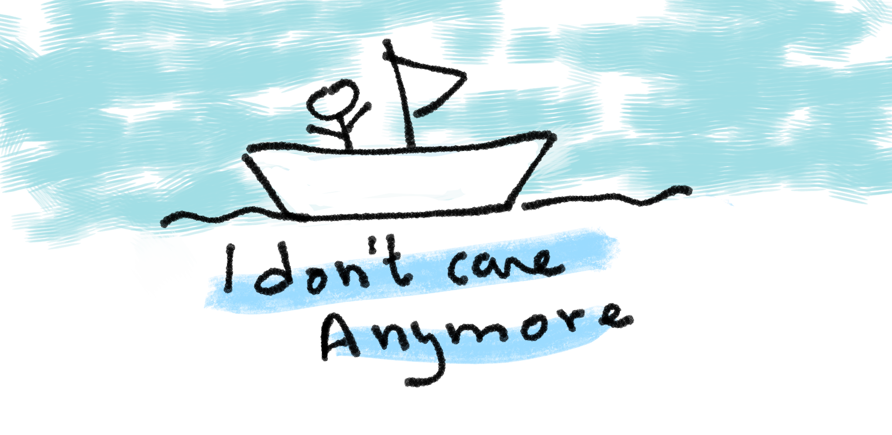

I've been studying CS for about three years now, and one thing has kept frustrating me for a while: the terminology. I still remember feeling so confused about the difference between **Component** and **Module**, or **DAO** vs **Repository**, and many other terms. Until I realized, one day, that it doesn't really matter.

Programmers come up with terms every passing day, and anyone can do it. At some point, I started to feel that two people in different contexts would come up with a term meaning pretty much the same concept. Later someone on Stack Overflow would confidently and happily explain to you the "nuances" in meaning that everybody misses. Of course, always starting the answer with "they are closely related but different" (or some AI tools that are even more confident), but often, no, it's actually simpler: ask the person using the term what they mean.

I also started to notice some terms are used in different programming ecosystems in a specific way. The same term could be used differently in different contexts. It's that simple.

And I had a deep relationship with terms; I grew up having translation as one of my hobbies. I fell in love with looking up a term's origin (etymology). I know a lot of cool trivia like why it's called a [lambda function](https://en.wikipedia.org/wiki/Anonymous_function) or why Shannon named it [_Entropy_](<https://en.wikipedia.org/wiki/Entropy_(information_theory)>) in information theory. And I'd happily correct you and explain the difference between a _higher-order function_ and a _first-class function_. Yet does it really matter?

But do you know why I decided to stop caring much about terminology? Three experiences actually:

## First experience

I was reading a discrete math book, Susanna's famous masterpiece. In one section she went like "all terms are defined using other terms, but this has to start from somewhere. In mathematical logic, the terms 'sentence', 'true' and 'false' are the initial undefined terms". I went like, what?! How could that be? Can we have undefined terms in MATH? Well, we do. We have undefined terms and axioms everywhere. We don't really know what "causality" means, or even a concept like "time", but we live with it. We clearly know it exists. And while we can't really explain it or prove it yet, we can build amazing things on top of it and have amazing scientific breakthroughs.

## Second experience

I was taking an [online course from UW about programming languages](https://www.coursera.org/learn/programming-languages). It was a great course and helped me pick up so many great terms that are actually useful. But at some point in the course, after explaining some functional programming concepts, the professor, Dan Grossman, then said: "People often confuse higher order functions and first class functions, so we won't care either". It was humbling. If a man with a PhD in programming languages doesn't care, why am I turning it into a battle?

It's also worth noting that the same Dan Grossman expressed frustration that people often call languages "compiled languages", when it's actually a property of the implementation and not the language itself. Because this actually leads to a distorted understanding of programming languages. So it's not always that simple; it's not either "terms don't matter" or "I'll kill you if you misuse it!".

## Third experience

The third insight might surprise you; I actually heard it from a psychiatrist talking about depression. He went like: we don't really know what depression is. In fact, it's not a disease like other diseases we know (like diabetes). That's why we call it a _disorder_; that is, a set of symptoms that we noticed often (but not always) come together. So we, the community of psychiatrists, agreed to call it "depression" to be able to communicate with each other. One day we discover a new case or a new symptom of what we call "depression", so we just add it to the list and maybe give this new "variant" a name (e.g. _high-functioning depression_). Well, nothing is that simple in real life, but the main idea here is that we truly don't really know what it is. But this doesn't stop us from pursuing the well being of people; with experience and scientific research we can treat it the best we can (with or without medication).

That was the most humbling words I've ever heard. And it was a deep lesson that now feels too obvious: **terms are simply created for understanding**. That is what matters at the end of the day. This isn't just about programming; sadly, we often go through fierce battles over a concept or a problem while not realizing that each of us has a different definition for it.

Terminology can be really intimidating to people just starting in the field. I feel we should emphasize how important it is to just take it easy.
